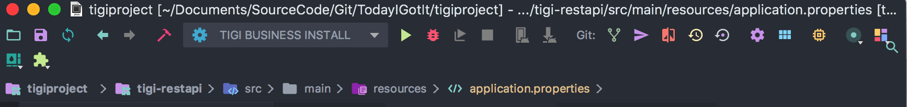
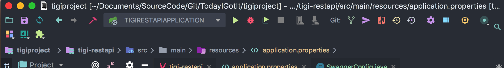
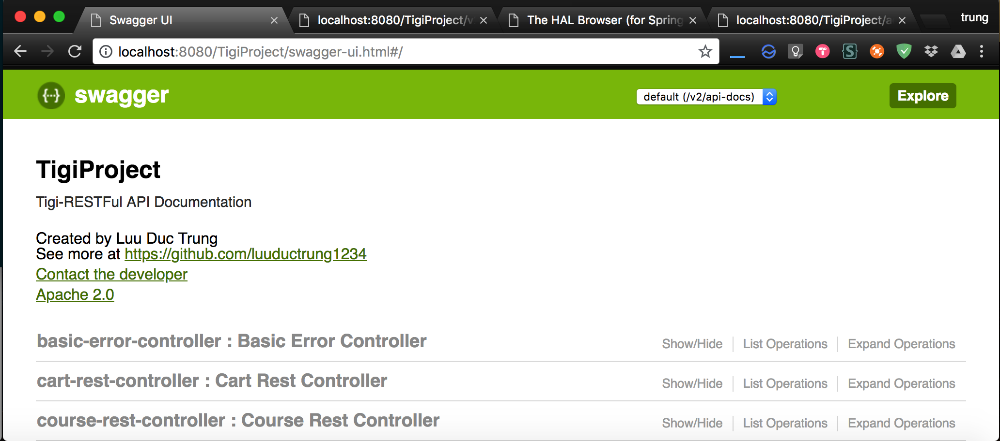
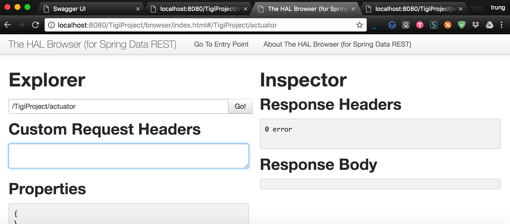

---


#  TodayIGotIt (TiGi)
:mortar_board: Today I Got It is a online learning webapp (inspired from [**Freecodecamp**](https://github.com/freeCodeCamp/freeCodeCamp) and [**Udemy**](https://www.udemy.com/))
```status: in progress```


---

## How to run

> - Open project in IntelliJ
> - Install the Tigi-Business module to local machine
> 
> - Execute the Tigi-Restapi Application
> 

For User
> - Visit Api Documentation [Swagger UI](http://localhost:8080/TigiProject/swagger-ui.html#/) - [API Docs in Json](http://localhost:8080/TigiProject/v2/api-docs)
> 
For Admnin
> - Using Spring Actuator to manage RESTFul API [Actuator in HAL Browser](http://localhost:8080/TigiProject/browser/index.html#/TigiProject/actuator)
> 


